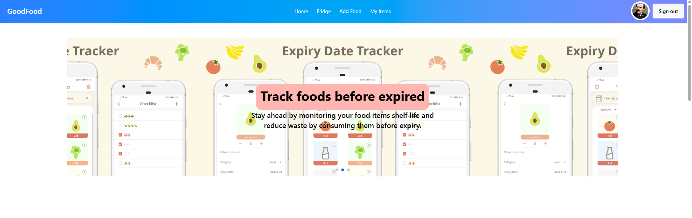

## Project Overview
The Food Expiry Tracker System is a web app that helps users track food items and get alerts before they expire. It aims to reduce food waste by allowing users to add, view, update, and manage food with expiry dates. It’s built to practice full-stack development with authentication, CRUD operations, and secure data handling. 

